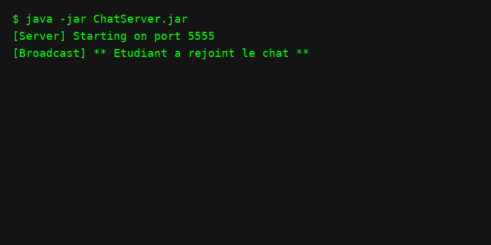
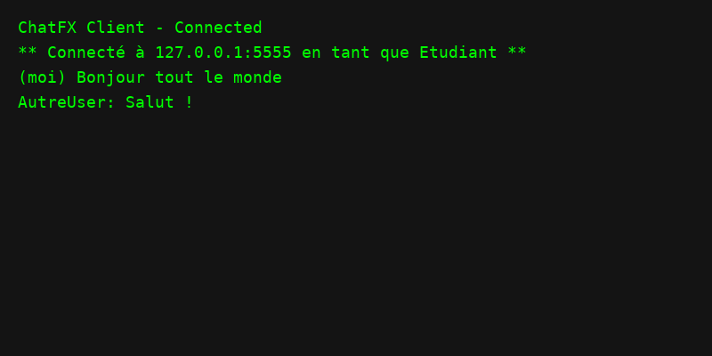
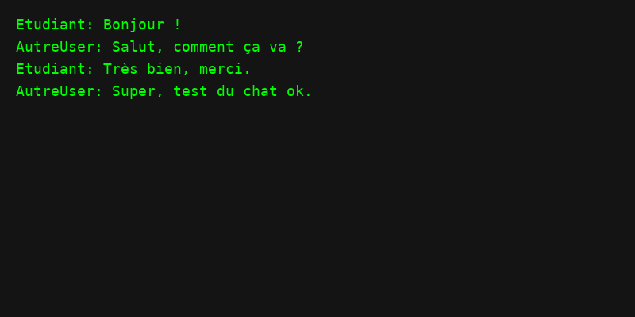

# ChatFX — JavaFX + Sockets + Threads

## Stack
- Java 17+
- JavaFX 21 LTS
- Maven 3.9+
- Sockets TCP, threads reader/handler

## Architecture
- `ChatServer` (CLI) : `ServerSocket` + un thread par client, diffusion (broadcast).
- `ClientApp` (JavaFX) : thread lecteur non bloquant, UI réactive (`Platform.runLater`).

## Prérequis
- `java -version` → 17+
- `mvn -version` → 3.9+
- Ports ouverts localement (par défaut 5555).

## Build
```bash
mvn -q -DskipTests package
```

## Lancer le serveur
```bash
# Port par défaut 5555
mvn -q exec:java -Dexec.mainClass=com.example.chat.server.ChatServer
# Port custom
mvn -q exec:java -Dexec.mainClass=com.example.chat.server.ChatServer -Dexec.args="6000"
```

## Lancer un client JavaFX
```bash
mvn -q javafx:run
```

## Captures d’écran
Place tes images dans `docs/screenshots/` puis référence-les ici :





## Tests fonctionnels
1. Lancer le serveur.
2. Lancer 2 clients et se connecter.
3. Envoyer un message depuis A → visible sur B.
4. Fermer B → message “déconnecté” diffusé.
5. Stopper le serveur → les clients affichent “Connexion fermée”.

## Licence
MIT
